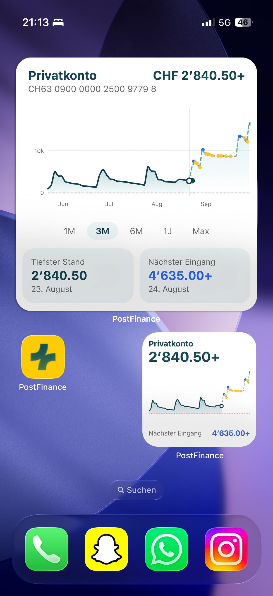
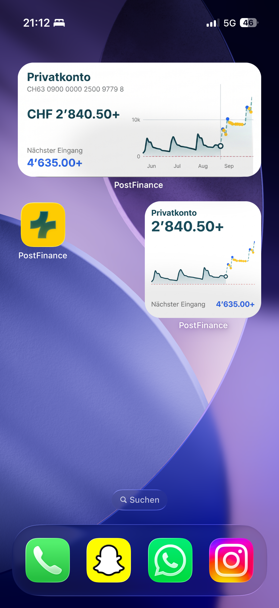
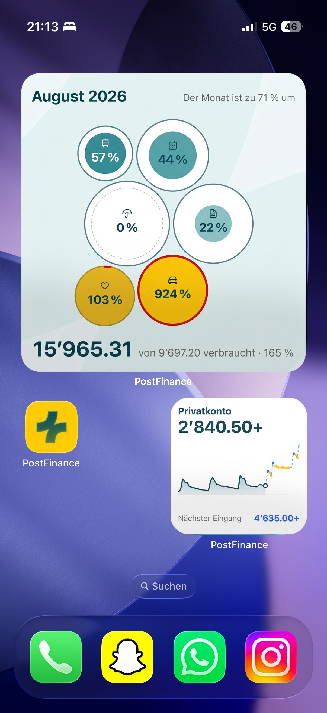

# Vitamin Gelb — Beyond the List
## Dokumentation für den Challenger (PostFinance)

> "What if banking not only showed what happened, but explained what it means?"

### Das Problem, wie wir es verstehen

Eine Banking-App zeigt heute, **was passiert ist**. Sie zeigt nicht, was es bedeutet.

Wir haben acht Menschen gefragt, wie sie ihre App benutzen. Alle antworten dasselbe: öffnen,
Kontostand lesen, schliessen. Auf die Frage «Wie findest du heraus, ob ein Monat normal war?»
antwortete einer wörtlich: **«Gar nicht.»** Die Auswertungen, die es dafür gäbe, kennt kaum
jemand — einer hat sie in Jahren drei- bis viermal geöffnet, einer nie.

Das Problem ist also nicht fehlende Information. Es ist, dass die vorhandene Information nichts
sagt und niemanden erreicht.

### Was wir gebaut haben

**Eine zweite Schicht über der bestehenden App, die aus Zahlen Aussagen macht — dort, wo ohnehin
hingeschaut wird.**

Der Kontostand auf Home wird zu Verlauf und Vorschau: was noch abgeht, was noch kommt. Ein
Signale-Bildschirm meldet von selbst, was aus der Reihe fällt, und legt zu jedem Hinweis die
Handlung daneben, die ihn erledigt. Ein Budget entsteht in drei Schritten aus den eigenen
Buchungen statt aus neunzehn leeren Feldern.

Wir haben dafür die heutige App nachgebaut und unsere Schicht sauber getrennt darübergelegt —
man sieht in derselben App, was Banking heute zeigt und was es zeigen könnte.

### Für wen

Privatpersonen zwischen 19 und 30. Belegt durch acht eigene Gespräche, alle geführt, bevor die
erste Zeile Produktcode entstand.

Aus ihnen fallen **zwei** Typen, und sie brauchen dasselbe Werkzeug aus verschiedenen Gründen:

- **«Kommt gut durch»** — Einkommen über Ausgaben, kein Leidensdruck, kein Grund hinzuschauen.
  Was zieht, ist Neugier: *Wofür eigentlich?*
- **«Ganz schlecht mit Geld»** — regelmässig im Minus, Mahnungen, ein gescheitertes Excel. Was
  zieht, ist die Vermeidung von Schmerz: *Reicht es?*

Der gemeinsame Nenner ist die Produktdefinition: **«Was ist gerade normal, was nicht — sag es
mir, ohne dass ich suchen muss.»**

KMU haben wir bewusst nicht bedient. Wir haben kein einziges KMU-Gespräch geführt, und eine
Zielgruppe ohne Beleg zu bauen hiesse raten.

### Warum das über den heutigen Stand hinausgeht

PostFinance hat heute Auto-Kategorisierung, Labels, Budgets mit Schwellen-Push, Abo-Erkennung,
CO₂-Rechner, Charts und Zeitvergleich. Das ist viel — und es ist **deskriptiv, pull-basiert und
pro Konto**. Vier Unterschiede:

| | heute | unsere Schicht |
|---|---|---|
| **Wer fragt** | der Kunde muss suchen | die App meldet sich |
| **Was gezeigt wird** | was war | was sich verändert hat, und was man tun kann |
| **Wo** | drei Ebenen tief in den Analysen | auf Home, im Suchfeld, als Hinweis |
| **Was zählt** | alles, was das Konto verlässt | Sparen ist keine Ausgabe |

Der letzte Punkt ist kein Detail. Zwei Gesprächspartner sagten unabhängig fast denselben Satz:
«Ich tue 500 Franken auf das Sparkonto, dann ist das wie quasi als Ausgabe — obwohl es
eigentlich gar nicht weg ist.» Wir trennen deshalb **ausgegeben** von **verschoben**. Damit ist
eine Zahl, die heute jede Auswertung verzerrt, zum ersten Mal richtig.

Und: Was die App kann, sagt sie jetzt selbst. Ein aktiver PostFinance-Kunde wünschte sich im
Gespräch eine Abo-Übersicht — die es längst gibt. Das ist kein Produktproblem, sondern ein
Wegproblem.

### Die Widgets

Was wir bauen, ist auch dann etwas wert, wenn man die App gar nicht öffnet. Darum gibt es
unsere Ansichten als iOS-Widgets — in mehreren Grössen und mit verschiedenem Inhalt, damit
sich jede und jeder auf den Home-Screen holt, was gerade zählt: den Verlauf mit Prognose,
oder das Budget des laufenden Monats.

#### Widget «Verlauf und Prognose»

| Gross | Mittel |
|---|---|
|  |  |

Beide Aufnahmen zeigen unten rechts zusätzlich das kleine Widget.

- **Gross** — der ganze Verlauf mit dem Zeitraumwähler (1M bis Max) und den zwei Kacheln
  «Tiefster Stand» und «Nächster Eingang», also die Kontoansicht des Prototyps eins zu eins.
- **Mittel** — Kontoname, IBAN, Saldo und der nächste Eingang links, der Verlauf rechts.
- **Klein** — Saldo, Verlauf und der nächste Eingang als eine Zeile.

Die durchgezogene Linie ist der gebuchte Verlauf, die gestrichelte die Prognose; die
gepunktete rote Linie ist die Null. Der nächste Eingang steht in Blau, weil er das ist,
worauf man wartet.

#### Widget «Budget als Blasen»

Eine Blase je Kategorie, und in jeder stecken drei Angaben:

- **Der Ring** ist das Budget. Sein Durchmesser folgt der Wurzel des Betrags, damit die
  *Fläche* proportional ist — bei proportionalem Radius sähe ein doppeltes Budget viermal
  so gross aus.
- **Die Füllung** ist, was davon weg ist — ebenfalls nach Fläche.
- **Der feine Strichring** ist der Monatsfortschritt. Ohne ihn lügt jede Verbrauchsanzeige
  in der Monatsmitte: Am 8. sind 25 % eines Budgets kein Rückstand, sondern Vorsprung.

Die Farbe läuft die Petrol-Rampe der Marke hinauf statt einer eigenen Ampel — je voller,
desto dunkler, und erst wo es eng wird, wechselt die Achse auf Orange und Gelb mit rotem
Bogen. Auf der Aufnahme sieht man die ganze Spanne: vier Kategorien im Plan (0 % bis 57 %),
eine knapp darüber (103 %, gelb mit kurzem rotem Bogen) und eine weit darüber (924 %,
voller roter Ring). Die Kopfzeile nennt den Monatsfortschritt, die Fusszeile das Ganze
in Zahlen.

**Stand beider Widgets:** Entwurf. Der Prototyp rendert Verlauf, Prognose und Blasen
bereits; die Widget-Fassung ist gestaltet, aber nicht als iOS-Extension gebaut.

> Die Symbole im Blasen-Entwurf stammen noch aus dem Gestaltungsvorschlag und decken sich
> nicht überall mit den sechs Kategorien im Code (`insights/budget/slots.ts`): Dort trägt
> «Mobilität und Kommunikation» ein Tram und «Gesundheitskosten» ein Herz mit Pulslinie,
> im Entwurf sind es ein Auto und ein schlichtes Herz. Vor der Abgabe entweder das Bild
> neu aufnehmen oder die Abweichung so stehen lassen — sie ist gestalterisch, nicht
> inhaltlich.

### Nutzen & Machbarkeit

**Für die Kundin.** Eine bemerkte Preiserhöhung von CHF 30 im Monat sind CHF 360 im Jahr. Eine
Vorschau, die auch die Abos kennt, beantwortet «kann ich mir das leisten» vor dem Kauf statt
danach. Und ein Budget, das sich selbst füllt, scheitert nicht am Aufsetzen.

**Für PostFinance.** Drei Dinge, die zusammenhängen:

- **Bestehende Funktionen werden erreichbar.** Der Wegweiser und der Assistent führen in
  Bildschirme, die gebaut und bezahlt sind und heute niemand findet.
- **Datenqualität, die von selbst entsteht.** Beim Zuordnen speichern wir am Händler statt an der
  Buchung — ein Zug korrigiert zwanzig Buchungen. Über die Kundenbasis hinweg entsteht ein Korpus
  echter Händler-Kategorie-Paare, den kein Regelwerk von innen erzeugen kann.
- **Ein Kanal, der bei dieser Zielgruppe noch trägt.** Das Misstrauen richtet sich gegen Beratung,
  nicht gegen Werkzeuge — «Absoluter Müll. Alles nur Provisionen.» Ein Hinweis, der rechnet statt
  empfiehlt, umgeht diesen Reflex.

**Aufwand zur Integration.** Fünf der sechs Funktionen berühren **das Kernbankensystem nicht** und
brauchen **keine neue Datenerfassung** — Buchungstext, Betrag und Datum genügen, alles davon
liegt vor. Der günstigste Einstieg ist jeweils klein:

| Funktion | Kleinster sinnvoller Schritt |
|---|---|
| Wegweiser | eine gepflegte Liste und ein Bildschirm — kein Motor, keine Berechnung |
| Liquidität | die vorhandene Saldovorschau um die **erkannten** Abos ergänzen |
| Zuordnung | die bestehende Korrektur am Händler speichern statt an der Buchung |
| Signale | ein einziger Erkenner: die Preiserhöhung einer wiederkehrenden Zahlung |
| Cockpit | allein die Pillenleiste, die das Wiederkehrende sichtbar macht |
| Assistent | die erste Stufe ohne Sprachmodell — trägt bei uns 62 % der echten Fragen |

Details je Funktion in der [Feature-Dokumentation](../Misc/) und im
[Tech-Jury-Dokument](TECH_JURY_DOC.md).

### Grenzen und Annahmen

- Alle gezeigten Finanzdaten sind **synthetisch**; es wurden keine echten Kundendaten verwendet.
- **Acht Gespräche sind eine schmale Basis** — überwiegend 19–30, Region Bern, technische Berufe,
  kein KMU. Wo wir keinen Beleg haben, sagen wir es.
- **Wir haben die Einstiegshürde gesenkt, nicht das Verhaltensproblem gelöst.** Ob Menschen ein
  Budget durchhalten, weiss nach 48 Stunden niemand. Der Berater, dem der Wizard am besten
  gefiel, fragte zweimal: «Aber es hat eben die Frage — machen das die Leute?»
- **Kein Schreibpfad in die Datenbank.** Die App rechnet lokal, damit sie ohne Schlüssel läuft.
  Was man in der Demo anlegt, überlebt kein Neuladen.
- **Zahlungen laufen durch, buchen aber nicht.** Eine echte Buchung würde jede abgeleitete Zahl
  verändern; eine ehrliche Attrappe ist uns lieber als eine halb echte Rechnung.
- **Beim Sprachmodell rechnet nichts.** Apertus formuliert und ordnet zu — jede Zahl kommt aus
  geprüftem Code. Der Grund ist gemessen: Beide Modellgrössen addieren vierzehn Beträge falsch.

### Offene Fragen an PostFinance

- **Warum kennt ein aktiver Kunde die Abo-Übersicht nicht?** Das ist unsere wichtigste Frage.
  Liegt es an der Platzierung, an der Benennung, oder wird sie schlicht nie angeboten?
- **Wie viele Kundinnen öffnen die Analysen im Monat?** Unser Befund — praktisch niemand — beruht
  auf acht Gesprächen. Ihr habt die Zahl.
- **Wie genau ist die automatische Kategorisierung wirklich?** Wir messen an unseren
  synthetischen Daten 96 %. An echten Daten dürfte sie tiefer liegen; wo, wisst nur ihr.
- **Dürften korrigierte Zuordnungen über die Kundenbasis gelernt werden?** Technisch ist es
  einfach, datenschutzrechtlich ist es eure Entscheidung.
- **Was darf ein Assistent einer Bank nicht sagen?** Unser Themenzaun ist ein Vorschlag aus
  gesundem Menschenverstand, keine Rechtsauskunft.
- **Gäbe es einen Weg zu echten, anonymisierten Buchungstexten?** Unsere Händlererkennung ist an
  erfundenen Daten gebaut. Der erste Praxistest würde sie sofort verbessern.
